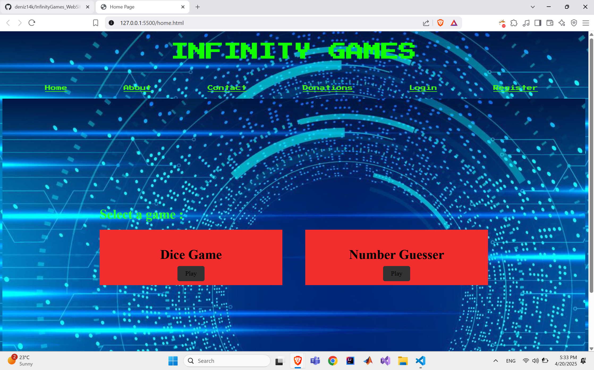
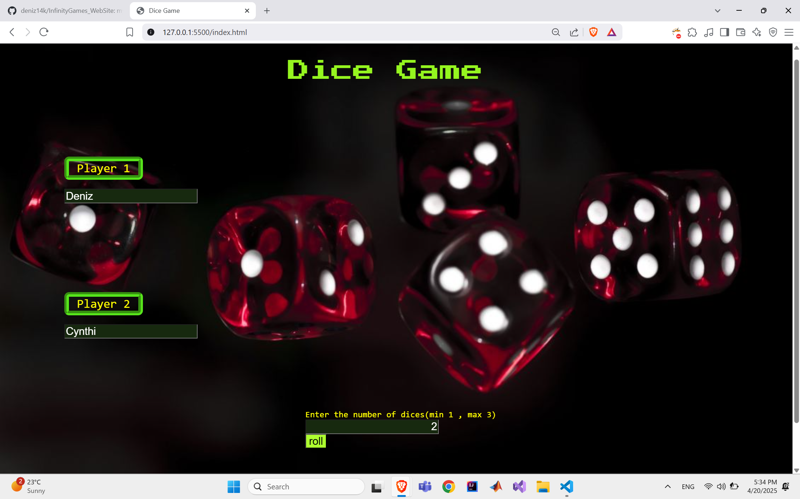
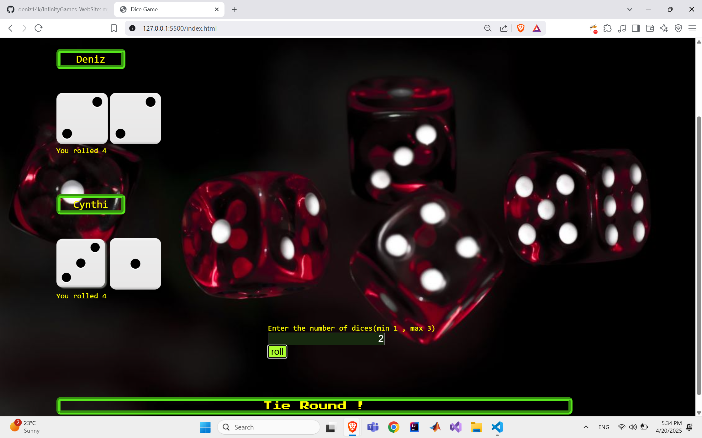
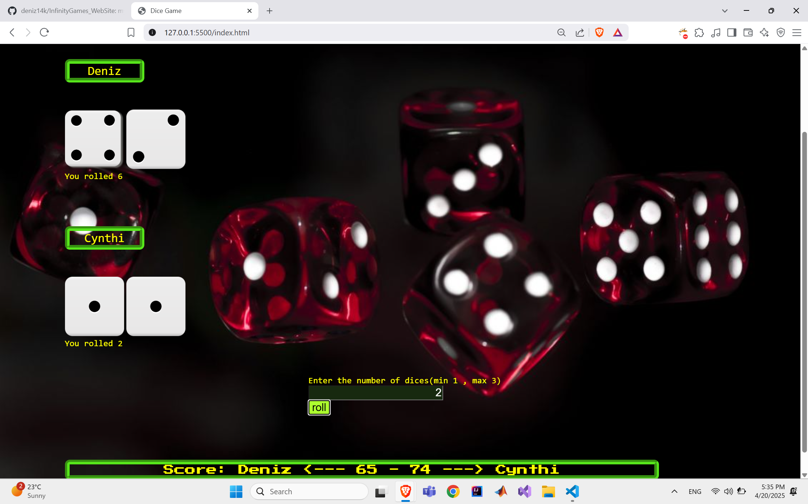
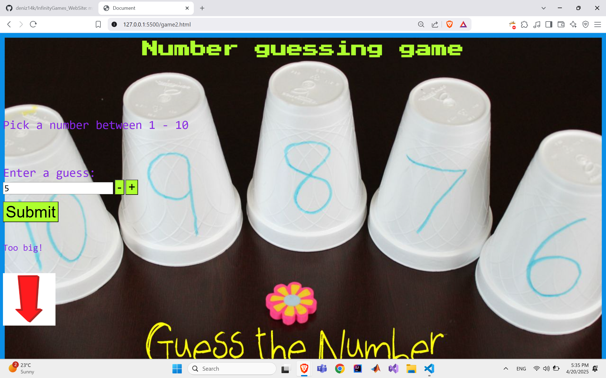
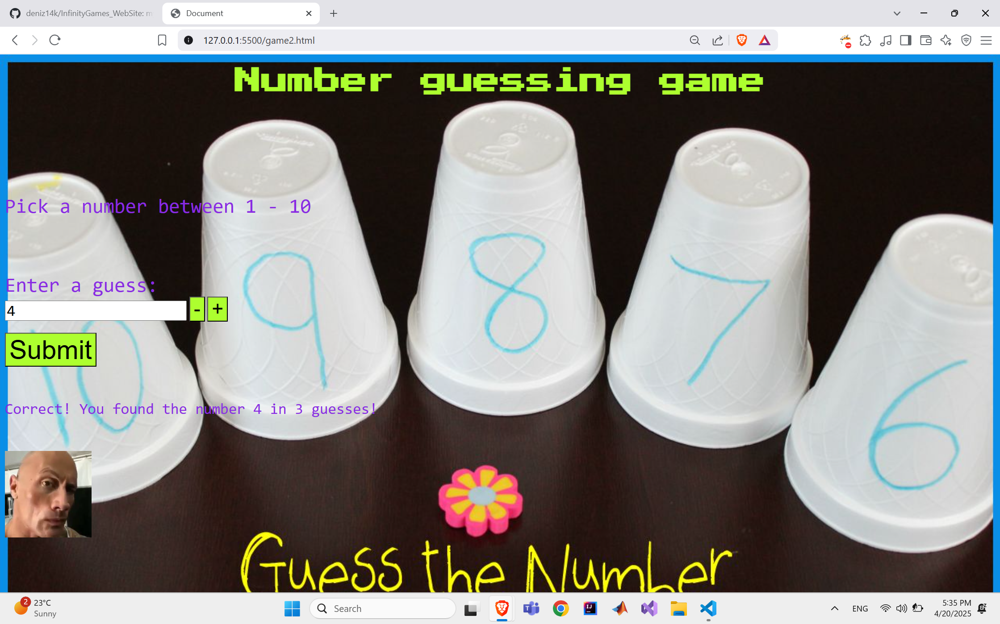
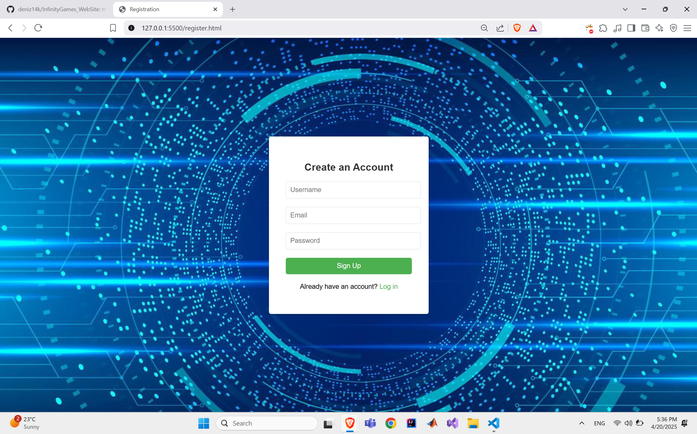
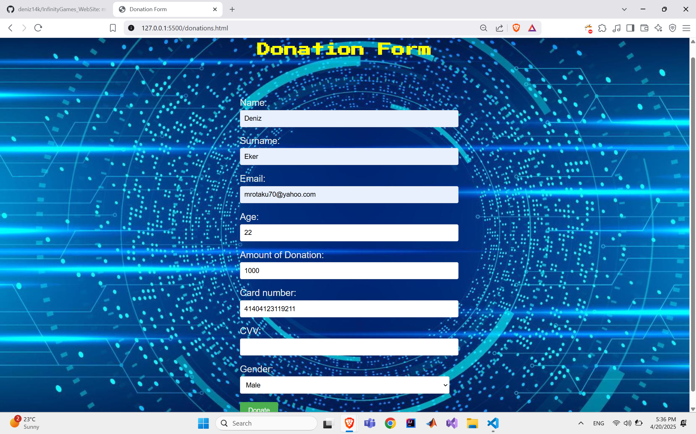

I started working on this project because I was excited about web dev, i wanted to learn about Web Development and I started doing this website by myself. 
With this personal project I learned about Javascript , Node.Js , HTML, CSS, MYSQL, and in general database connections and requests.
I also provided a database management system on my local computer, it worked, i used XAMPP and also phpMyAdmin. 

Here are some screnshots of how the app is working : 

